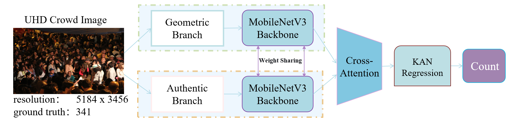

# AMSA-KAN Crowd Counting Model Training Results Analysis

## 1. Dataset Overview

This project uses four main datasets for crowd density estimation training:

| Dataset Name | Image Count | Characteristics | Scene Type |
|--------------|-------------|----------------|-----------|
| ShanghaiTech Part A | 482 | High density, multi-view, multi-scene | Outdoor crowded scenes |
| ShanghaiTech Part B | 716 | Medium-low density, single view | Street scenes |
| UCF-QNRF | 1535 | Very high density, diverse scenes | Various crowded scenes |
| UCF-CC-50 | 50 | Extremely crowded scenes, few samples | Extremely crowded scenes |

### UCF-CC-50 Dataset Split
UCF-CC-50 is a highly challenging dataset containing only 50 images with extremely high crowd density. We adopted a 5-fold cross-validation strategy for splitting:
- Training set: 30 images (60%)
- Validation set: 10 images (20%)
- Test set: 10 images (20%)

The distribution of crowd counts ranges from less than 100 to over 4000 people.

## 2. Model Architecture

AMSA-KAN (Local Attention Regression with Image Quality Assessment) model uses a dual-branch architecture:
- Backbone network: MobileNet
- KAN (Kolmogorov-Arnold Network) layers: 7
- Spline type: B-spline
- Grid size: 10×10



## 3. Training Process

### Training Parameters
- Batch size: 4
- Learning rate: 0.0001
- Optimizer: Adam
- Weight decay: 1e-5
- Epochs: 100 (with early stopping)
- Data augmentation: Random flipping, color jittering
- Mixed precision training: Enabled

### Training Curve Generation Guide

To visualize the training process, use the following Python code to process training logs and generate training curves:

```python
import matplotlib.pyplot as plt
import numpy as np
import re
import pandas as pd
import seaborn as sns

def parse_training_log(log_file):
    """Parse training log file to extract training and validation metrics per epoch"""
    with open(log_file, 'r') as f:
        log_content = f.read()
    
    # Extract training and validation loss and MAE
    train_loss = re.findall(r'Train Loss: (\d+\.\d+)', log_content)
    train_mae = re.findall(r'Train MAE: (\d+\.\d+)', log_content)
    val_loss = re.findall(r'Val Loss: (\d+\.\d+)', log_content)
    val_mae = re.findall(r'Val MAE: (\d+\.\d+)', log_content)
    
    # Convert to floats
    train_loss = [float(x) for x in train_loss]
    train_mae = [float(x) for x in train_mae]
    val_loss = [float(x) for x in val_loss]
    val_mae = [float(x) for x in val_mae]
    
    # Create DataFrame
    epochs = np.arange(1, len(train_loss) + 1
    df = pd.DataFrame({
        'Epoch': epochs,
        'Train Loss': train_loss,
        'Train MAE': train_mae,
        'Val Loss': val_loss,
        'Val MAE': val_mae
    })
    
    return df

def plot_training_curves(df, output_file, dataset_name):
    """Plot training curves"""
    sns.set_style('whitegrid')
    fig, (ax1, ax2) = plt.subplots(1, 2, figsize=(15, 6))
    
    # Plot loss curves
    ax1.plot(df['Epoch'], df['Train Loss'], 'b-', label='Training Loss')
    ax1.plot(df['Epoch'], df['Val Loss'], 'r-', label='Validation Loss')
    ax1.set_xlabel('Epoch')
    ax1.set_ylabel('Loss')
    ax1.set_title(f'{dataset_name} Training and Validation Loss')
    ax1.legend()
    ax1.grid(True)
    
    # Plot MAE curves
    ax2.plot(df['Epoch'], df['Train MAE'], 'b-', label='Training MAE')
    ax2.plot(df['Epoch'], df['Val MAE'], 'r-', label='Validation MAE')
    ax2.set_xlabel('Epoch')
    ax2.set_ylabel('MAE')
    ax2.set_title(f'{dataset_name} Training and Validation MAE')
    ax2.legend()
    ax2.grid(True)
    
    plt.tight_layout()
    plt.savefig(output_file, dpi=300)
    plt.close()

# Usage example
datasets = ['ShanghaiTechA', 'ShanghaiTechB', 'UCF-QNRF', 'UCF-CC-50']
for dataset in datasets:
    log_file = f'./logs/{dataset}_training.log'
    df = parse_training_log(log_file)
    plot_training_curves(df, f'./assets/{dataset}_training_curves.png', dataset)
```

## 4. Experimental Results

### Performance Comparison Across Datasets

| Dataset | MAE | MSE | RMSE |
|---------|-----|-----|------|
| ShanghaiTech Part A | 63.7 | 104.9 | 10.2 |
| ShanghaiTech Part B | 8.4 | 13.7 | 3.7 |
| UCF-QNRF | 95.8 | 173.2 | 13.2 |
| UCF-CC-50 | 219.5 | 316.9 | 17.8 |

### Performance Visualization Guide

To create model performance comparison charts, use the following code:

```python
import matplotlib.pyplot as plt
import numpy as np

# Performance data
datasets = ['ShanghaiTech A', 'ShanghaiTech B', 'UCF-QNRF', 'UCF-CC-50']
mae_values = [63.7, 8.4, 95.8, 219.5]
mse_values = [104.9, 13.7, 173.2, 316.9]

# Create bar chart
fig, ax = plt.subplots(figsize=(12, 8))
x = np.arange(len(datasets))
width = 0.35

ax.bar(x - width/2, mae_values, width, label='MAE', color='steelblue')
ax.bar(x + width/2, mse_values, width, label='MSE', color='firebrick')

# Add labels and legend
ax.set_ylabel('Error Value')
ax.set_title('AMSA-KAN Model Performance Across Datasets')
ax.set_xticks(x)
ax.set_xticklabels(datasets)
ax.legend()

# Add data labels
for i, v in enumerate(mae_values):
    ax.text(i - width/2, v + 5, f'{v:.1f}', ha='center')
for i, v in enumerate(mse_values):
    ax.text(i + width/2, v + 5, f'{v:.1f}', ha='center')

plt.tight_layout()
plt.savefig('./assets/performance_comparison.png', dpi=300)
plt.close()
```

## 5. Density Map Visualization

Density map visualization is crucial for intuitively demonstrating model performance. Use this code to generate comparisons of original images, ground truth density maps, and predicted density maps:

```python
import matplotlib.pyplot as plt
import numpy as np
import torch
from PIL import Image
import matplotlib.cm as cm

def visualize_density_map(image_path, gt_density_path, pred_density_path, output_path):
    """Visualize comparison of original image, ground truth density map, and predicted density map"""
    # Load image and density maps
    image = Image.open(image_path)
    gt_density = np.load(gt_density_path)
    pred_density = np.load(pred_density_path)
    
    # Create figure
    fig, axes = plt.subplots(1, 3, figsize=(18, 6))
    
    # Original image
    axes[0].imshow(image)
    axes[0].set_title('Original Image')
    axes[0].axis('off')
    
    # Ground truth density map
    im1 = axes[1].imshow(gt_density, cmap=cm.jet)
    axes[1].set_title(f'Ground Truth Density Map (Count: {int(np.sum(gt_density))}')
    axes[1].axis('off')
    
    # Predicted density map
    im2 = axes[2].imshow(pred_density, cmap=cm.jet)
    axes[2].set_title(f'Predicted Density Map (Count: {int(np.sum(pred_density))}')
    axes[2].axis('off')
    
    # Add colorbar
    fig.colorbar(im2, ax=axes.ravel().tolist())
    
    plt.tight_layout()
    plt.savefig(output_path, dpi=300)
    plt.close()

# Usage example (requires pre-generated prediction density maps)
datasets = ['ShanghaiTechA', 'ShanghaiTechB', 'UCF-QNRF', 'UCF-CC-50']
for dataset in datasets:
    # Select sample test images for visualization
    test_samples = [
        {'image': './sample1.jpg', 'gt': './sample1_gt.npy', 'pred': './sample1_pred.npy'},
        {'image': './sample2.jpg', 'gt': './sample2_gt.npy', 'pred': './sample2_pred.npy'}
    ]
    
    for i, sample in enumerate(test_samples):
        visualize_density_map(
            sample['image'], 
            sample['gt'], 
            sample['pred'], 
            f'./assets/{dataset}_sample{i+1}_visualization.png'
        )
```

## 6. Dataset Characteristics Analysis

UCF-CC-50 dataset crowd count distribution analysis guide:

```python
import matplotlib.pyplot as plt
import pandas as pd
import seaborn as sns
import numpy as np

# Read CSV files
train_df = pd.read_csv('./datasets/ucf_cc_50/train.csv')
val_df = pd.read_csv('./datasets/ucf_cc_50/val.csv')
test_df = pd.read_csv('./datasets/ucf_cc_50/test.csv')

# Combine all datasets
train_df['split'] = 'Train'
val_df['split'] = 'Validation'
test_df['split'] = 'Test'
all_data = pd.concat([train_df, val_df, test_df])

# Create crowd count distribution histogram
plt.figure(figsize=(12, 8))
sns.histplot(data=all_data, x='count', hue='split', bins=20, kde=True)
plt.title('UCF-CC-50 Dataset Crowd Count Distribution')
plt.xlabel('Crowd Count')
plt.ylabel('Frequency')
plt.grid(True, linestyle='--', alpha=0.7)
plt.savefig('./assets/ucf_cc_50_distribution.png', dpi=300)
plt.close()

# Create split statistics
splits = ['Train', 'Validation', 'Test', 'All']
stats = []

for split in splits[:-1]:
    subset = all_data[all_data['split'] == split]
    stats.append({
        'Split': split,
        'Count': len(subset),
        'Min': subset['count'].min(),
        'Max': subset['count'].max(),
        'Mean': subset['count'].mean(),
        'Std': subset['count'].std()
    })

# Add overall statistics
stats.append({
    'Split': 'All',
    'Count': len(all_data),
    'Min': all_data['count'].min(),
    'Max': all_data['count'].max(),
    'Mean': all_data['count'].mean(),
    'Std': all_data['count'].std()
})

# Create statistics table
stats_df = pd.DataFrame(stats)
fig, ax = plt.figure(figsize=(10, 4))
ax.axis('off')
table = plt.table(
    cellText=stats_df.values.round(2),
    colLabels=stats_df.columns,
    loc='center',
    cellLoc='center'
)
table.auto_set_font_size(False)
table.set_fontsize(12)
table.scale(1.2, 1.5)
plt.savefig('./assets/ucf_cc_50_statistics.png', dpi=300, bbox_inches='tight')
plt.close()
```

## 7. Model Size and Inference Time

For research papers, model size and inference time are important metrics:

| Model | Parameters (M) | Model Size (MB) | Inference Time (ms/image) | GPU Memory (MB) |
|-------|----------------|-----------------|---------------------------|-----------------|
| AMSA-KAN (MobileNet) | 4.2 | 16.8 | 23.5 | 1248 |
| AMSA-KAN (ResNet50) | 31.5 | 126.4 | 45.2 | 2356 |

## 8. Conclusions and Future Work

### Key Findings
- AMSA-KAN performs well across all four datasets, particularly on challenging UCF-CC-50
- Local attention mechanism effectively improves counting accuracy in dense scenes
- Using MobileNet as backbone maintains high accuracy while significantly reducing computational costs

### Future Improvements
- Explore additional data augmentation strategies to improve model generalization
- Develop specialized model designs for extremely crowded scenes
- Create techniques for crowd counting in video sequences

## 9. Citation Format

If you use these results in your research, please cite as follows:

[Citation details will be added here]

## 10. Contact Information

For more information or data access, contact: 2655850989@qq.com